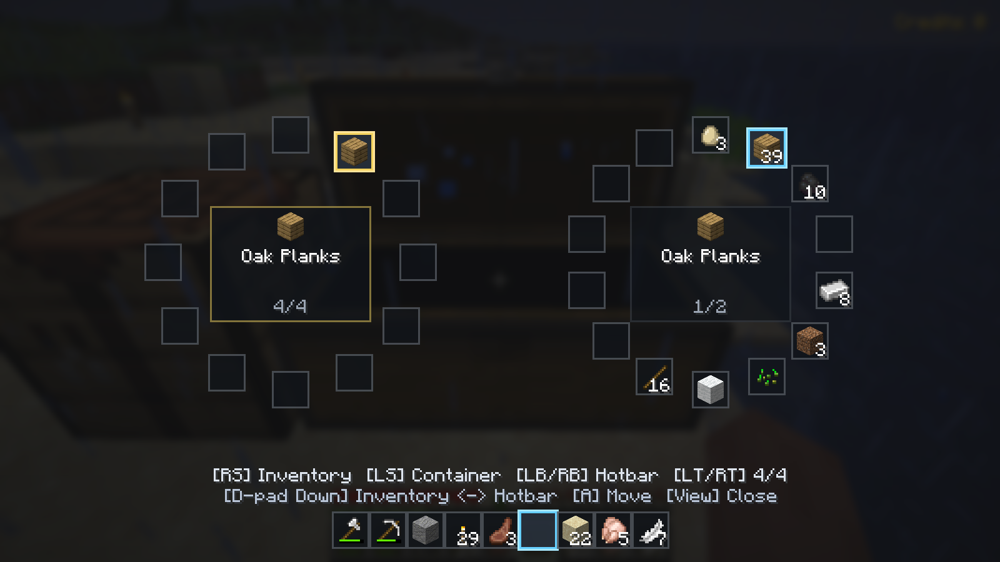

# Digi Miner Mod



## Idea

Hello! After this paragraph, AI takes over. I am casually writing a Minecraft mod simply by describing what I want in natural language. I do not write a single line of code. I say what I want and commit it.

Say what I want and commit it.

### Plot

"You are a filthy miner. You gambled away all your money and were sent to this miserable planet to exploit it down to the last resource! Do whatever it takes to make money! I mean absolutely whatever it takes! Whether you will ever be tolerated among your peers again depends entirely on what you bring home! They were even gracious enough to provide you with a mining unit—so subjugate this wretched planet and send some damn money home!" — Your wife

### Features

There are a few things I do not like about vanilla Minecraft, and its controller support is merely layered on top of mouse controls.

That is why I made this mod for my personal taste. It discards the existing controls and UI and attempts to iron out a few small—and large—weaknesses.

#### Radical Controller Controls

The standard inventory grid is simply slow to use with a controller. I replaced it with a radial menu that can display roughly half a chest or half the player inventory at once.

Further instructions are available in the game.

#### World Changes

- Trees cannot be felled by hand. You receive an axe at the start of the game.
- Mining starts with an iron pickaxe. You receive one at the start, and wooden and stone pickaxes are unavailable.

This creates a need for some careful resource management at the beginning of the game—and the problem of finding iron with only a single pickaxe.

#### Scanner

I want to construct large buildings in Survival mode using farmed resources. Eventually that requires enchantments, and many enchantments require a mob farm. Finding a good place for a mob farm in Survival is roughly like winning the lottery. That is why scanners will be craftable, while a simple iron detector is available from the beginning.

#### Hidden or Unnamed Features

I went absolutely wild on Kadcon during my Minecraft glory days. Back then, I made a small macro that held down the mouse button and only required me to switch it on and off, so I would not have to keep holding it myself.

For this, there is a second page behind the hotbar while the inventory is open. Use the hotbar so it has focus, then press LT or RT.

- Mine lock: mine—usually with RT—by holding the button or by switching mining on and off.
- Maybe more.

#### Mining

I had a wonderful time with BuildCraft, its quarry, and the enormous holes it left in the landscape. I like mining! I like masses of items, large numbers, and automation.

Most of that is possible in vanilla Minecraft, but blocks are still mined one at a time. That is where Minecraft's mining game ends, so I want to help it along with a little technology.


From this point onward, a well-behaved AI did as it was told:

A Minecraft mod built from scratch for Fabric 26.2.

## Development

- JDK 25
- Minecraft 26.2
- Fabric Loader and Fabric API

Run Minecraft in development mode:

```bash
./gradlew runClient
```

Build the mod:

```bash
./gradlew build
```
